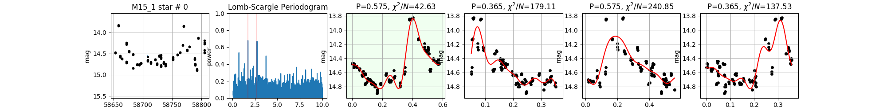

# getPeriod

A data reduction tool for observational astro samples with periodic luminosity changes. Under development.

-------------------

-------------------
### Dependencies
- numpy
- scipy
- matplotlib
- pandas
- astropy
- pickle (only for ``example.py``)

### Quick Usage
Running
```examply.py```
is recommended. Or,

```python
from getPeriod import *

target = [xdata,ydata,yerr] # for single star
vstars = period_analysis([target],K=5,show_plot=True)

```
